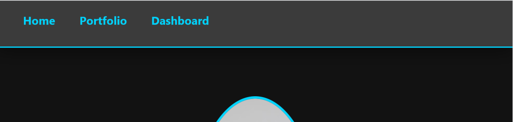
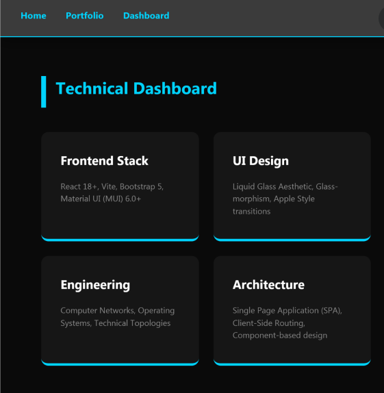
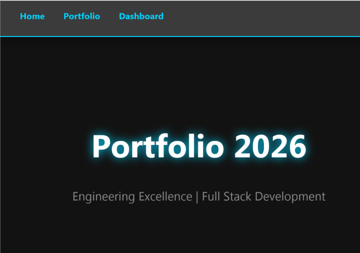
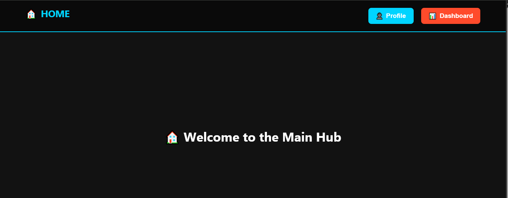
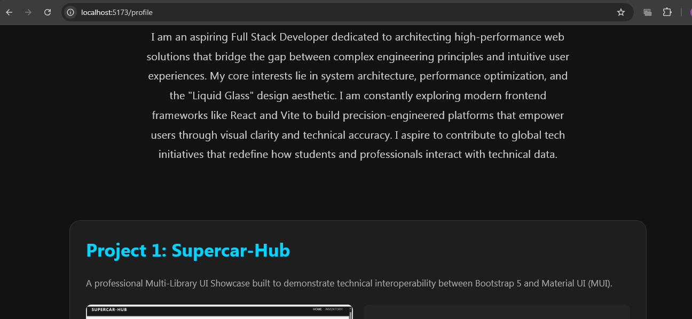
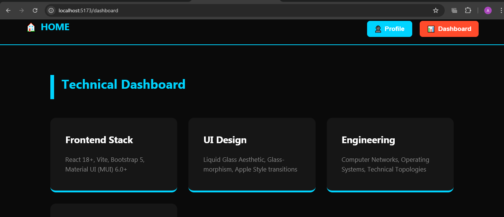
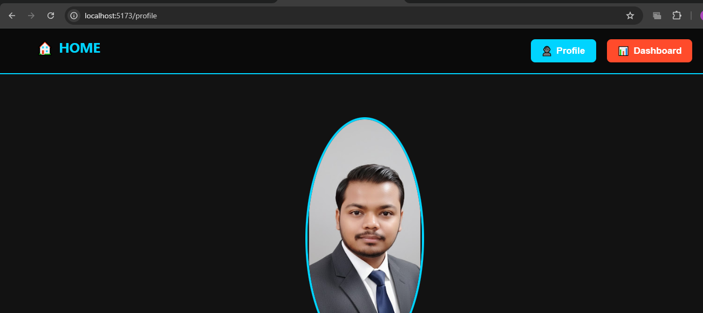

# 🚀 Single Page Application (SPA) Routing Portfolio

This project documents the architectural evolution of a React-based Single Page Application, progressing from standard text-based link navigation to an advanced, interactive button-driven interface.

---

## 🧪 Experiment 2: Navigation Using Link Component

### **Aim**
To implement responsive navigation links in a Single Page Application using the React Router `Link` component.

### **Technical Overview**
In this experiment, the foundational routing architecture was established. The focus was on enabling seamless state transitions between the **Profile** and **Dashboard** views without triggering browser reloads.

* **Semantic Routing**: Mapped `/profile` and `/dashboard` to specific functional components.
* **SPA Methodology**: Utilized the `<Link>` component from `react-router-dom` to intercept browser requests and update the UI via the HTML5 History API.
* **UI/UX Design**: Developed a centered, high-contrast dashboard layout with neon cyan accents.

### **Visual Gallery (Iteration 1)**
| Technical Dashboard | Profile Architecture | Navigation System |
| :---: | :---: | :---: |
|  |  |  |

---

## 🧪 Experiment 3: Multi-Page SPA Using Routing

### **Aim**
To architect a multi-page SPA utilizing interactive button-driven navigation and "YouTube-style" brand redirection logic.

### **Professional Aspirations**
I am an aspiring Full Stack Developer dedicated to architecting high-performance web solutions that bridge the gap between complex engineering principles and intuitive user experiences. My core interests lie in system architecture, performance optimization, and the "Liquid Glass" design aesthetic. I am constantly exploring modern frontend frameworks like React and Vite to build precision-engineered platforms that empower users through visual clarity and technical accuracy.

### **Visual Gallery (Iteration 2)**
| YouTube-Style Home Link | Action-Button Interface | Full System Preview |
| :---: | :---: | :---: |
|  |  |  |

### **Project Showcases**
| Project 1: Supercar-Hub | Project 2: Exam Pulse |
| :---: | :---: |
|  |  |
| **Tech Stack**: Bootstrap 5 & MUI | **Aesthetic**: Liquid Glass & High-Res Maps |

---

## 🛠️ Technical Specifications
* **Core Engine**: React 18+ (Vite)
* **Routing Logic**: React Router DOM v6.x
* **Component Libraries**: Material UI (MUI) & Bootstrap 5.3
* **Layout Logic**: Flexbox Geometry & Viewport Scaling (`100vh`)

---
*Developed with excellence in India 🇮🇳 - 2026*