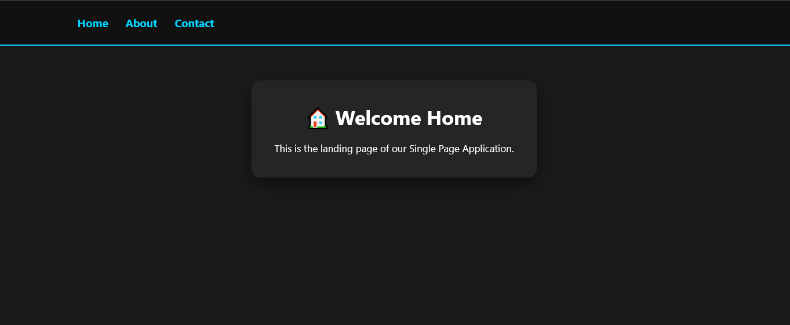
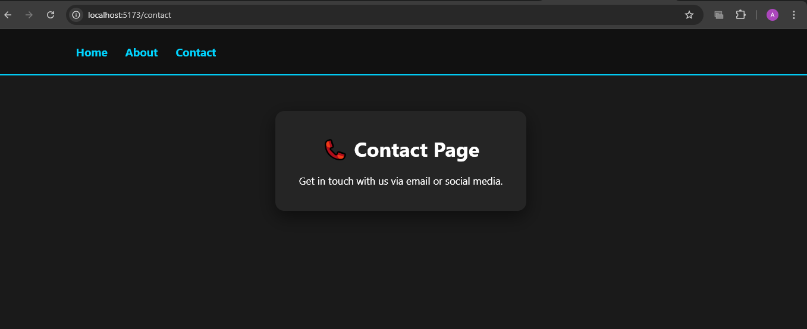

# 🚀 Experiment 3.1: Basic Client-Side Routing in React

A technical implementation of a **Single Page Application (SPA)** architecture, demonstrating foundational client-side routing principles using **React** and **Vite**.

---

## 🎯 Aim
To design and implement basic client-side routing within a React-based Single Page Application utilizing the `react-router-dom` library to enable fluid navigation without page reloads.

---

## 🛠️ Software Requirements
* **Node.js**: JavaScript runtime environment.
* **React**: Frontend library for component-based UI.
* **React Router DOM**: Specialized library for handling web browser routing.
* **Web Browser**: For testing and rendering the SPA.

---

## 📚 Theory
Routing in a Single Page Application allows users to navigate between different views (components) without the browser requesting a new HTML document from the server. This is achieved by:
* **`BrowserRouter`**: Wrapping the app to manage navigation history.
* **`Routes` & `Route`**: Defining the conditional logic to swap components based on the URL path.
* **`Link`**: Intercepting clicks to update the URL without a page refresh.

---

## 📝 Implementation Procedure

### **Phase 1: Project Setup**
1. Initialize the project using the Vite React template.
2. Install the `react-router-dom` package via npm.

### **Phase 2: Routing Architecture**
The application root was wrapped in a `<BrowserRouter>` provider. Three functional components (**Home**, **About**, and **Contact**) were mapped to explicit paths.

### **Phase 3: Navigation Logic**
Standard anchor tags were replaced with the `<Link>` component to ensure navigation occurs entirely on the client side, fulfilling the primary SPA requirement.

---

## 🖼️ Visual Documentation (UI Gallery)

The following screenshots confirm successful routing and state management across the three primary views.

| **🏠 Home View (Root)** | **ℹ️ About Interface** | **📞 Contact Portal** |
| :---: | :---: | :---: |
|  |  |  |

---

## 📊 Observations & Results
* **Zero Postbacks**: Switching between tabs results in an immediate UI update with no browser "blink" or reload.
* **Dynamic Rendering**: The React engine successfully swaps DOM nodes in the main content area while maintaining a static navigation header.
* **History Management**: The browser's "Back" and "Forward" buttons function correctly as the URL stays in sync with the active component.

---

## ⚙️ How to Run
1. Navigate to the project directory: `cd fsd_exp3.1`
2. Install dependencies: `npm install`
3. Start the dev server: `npm run dev`

---
*Developed for the Web Development Lab Series - 2026*